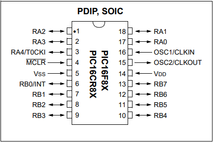

# Quick Guide to p16F83-1
## Reference of the PIC16 used by the MICROCHIP brand
- PIC16F83-1

**NOTE** This PIC16F microcontroller features digital outputs, digital inputs, ADC, PWM and serial communication.

## Pin Names
Pin names are named with a letter indicating the port and a number indicating the pin. For example, a2 indicates pin 2 of port A. All names in Aixt are written in lowercase [V variable naming rules.](https://github.com/vlang/v/blob/master/doc/docs.md#variables)

### PIC16F83-1 pin names

| Port  | 0    | 1    | 2    | 3    | 4    | 5     | 6     | 7     |
| :---: | ---- | ---- | ---- | ---- | ---- | ----- | ----- | ----- |
| **A** | `a0` | `a1` | `a2` | `a3` | `a4` | ----- | ----- | ----- |
| **B** | `b0` | `b1` | `b2` | `b3` | `b4` | `b5`  | `b6`  | `b7`  |



- `MCLR` It means Master Clear / Reset, that is, a controller reset pin and it connects to Vcc (+5V).
- `OSC` Oscillator Pins stands for Oscillator Pins, which control the system clock, determining the program execution speed. For the PIC16F83-1, it's an internal output, in crystal mode, connecting to the second pin (it has one input and one output, OSC1 and OSC2).
- `VDD` Positive power and ground reference for logic and I/O pins, respectively. These pins have diode protection.
- `VSS` Stands for Voltage Source, Source or Voltage Supply Source and is the ground pin (GND), also known as voltage reference, 0 volts for the entire circuit.

It has two analog circuit input and output pins to show the programmed on and off behavior of the LED.

| Port  | 0   | 1   | 2   | 3    | 4    | 5     | 6     | 7     |
| :---: | --- | --- | --- | ---- | ---- | ----- | ----- | ----- |
| **A** | -   | -   | -   | -    | -    | ----- | ----- | ----- |
| **B** | -   | -   | -   | `b3` | `b4` | -     | -     | -     |

## General $\mu C$ control

```v
// by default the CPU oscillation frequency is 10Mhz
@[as_macro] const cpu_freq = 4_000_000  // change it to 4Mhz
```
## Delay
Use the `time` module:

```v
import time

time.sleep(2)            // sleep for 2 seconds
time.sleep_ms(50)        // sleep for 50 milliseconds
time.sleep_us(100)       // sleep for 100 microseconds
```

### Functions
| name                  | description           |
| --------------------- | --------------------- |
| `time.sleep(time)`    | Delay in seconds      |
| `time.sleep_us(time)` | Delay in microseconds |
| `time.sleep_ms(time)` | Delay in milliseconds |

## Pins
Use the `pin` module:

```v
import pin

pin.setup(pin.a1, pin.input)
pin.high(pin.b0)
pin.low(pin.a3)
pin.toggle(pin.b7)
pin.write(pin.b2, pin.read(pin.a1)) // pin echo
```

### Functions
| name                    | description               |
| ----------------------- | ------------------------- |
| `pin.setup(pin, mode)`  | Configure `pin` as `mode` |
| `pin.high(pin)`         | Turn On `pin`             |
| `pin.low(pin)`          | Turn Off `pin`            |
| `pin.toggle(pin)`       | Toggle the state of `pin` |
| `pin.write(pin, value)` | Write `value` in `pin`    |
| `pin.read(pin)`         | Return the state of `pin` |

## Pin ports
Manage pins as inputs or outputs. Using the `port` module:

```v
import port

port.setup(port.b, port.all_outputs)
port.setup(port.a, 0x00111111)  // port A bit 7 and 6 as outputs, the rest as inputs

val := port.read(port.a)
port.write(port.b, val) // port echo
```

### Functions
| name                      | description                |
| ------------------------- | -------------------------- |
| `port.setup(port, mode)`  | Configure `port` as `mode` |
| `port.read(port)`         | Return the value of `port` |
| `port.write(port, value)` | Write `value` to `port`    |

## External Interrupt
Use the `ext` module:

```v
import ext

ext.setup(ext.falling)	// rising edge for external interrupt
ext.irq_enable()		// enable the interrupt
```

### Functions
| name                | description                         |
| ------------------- | ----------------------------------- |
| `ext.setup(edge)`   | Configure external interrupt `edge` |
| `ext.irq_enable()`  | Enable external interrupt           |
| `ext.irq_disable()` | Disable external interrupt          |